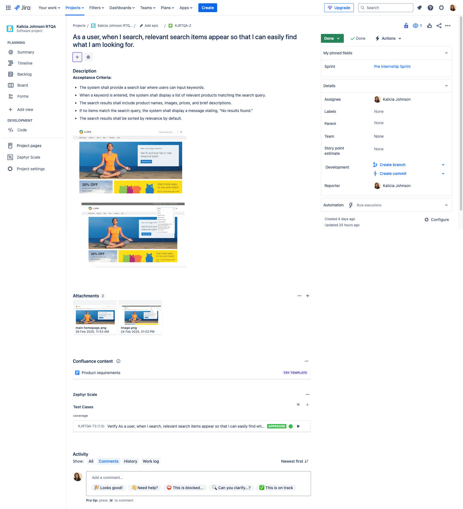
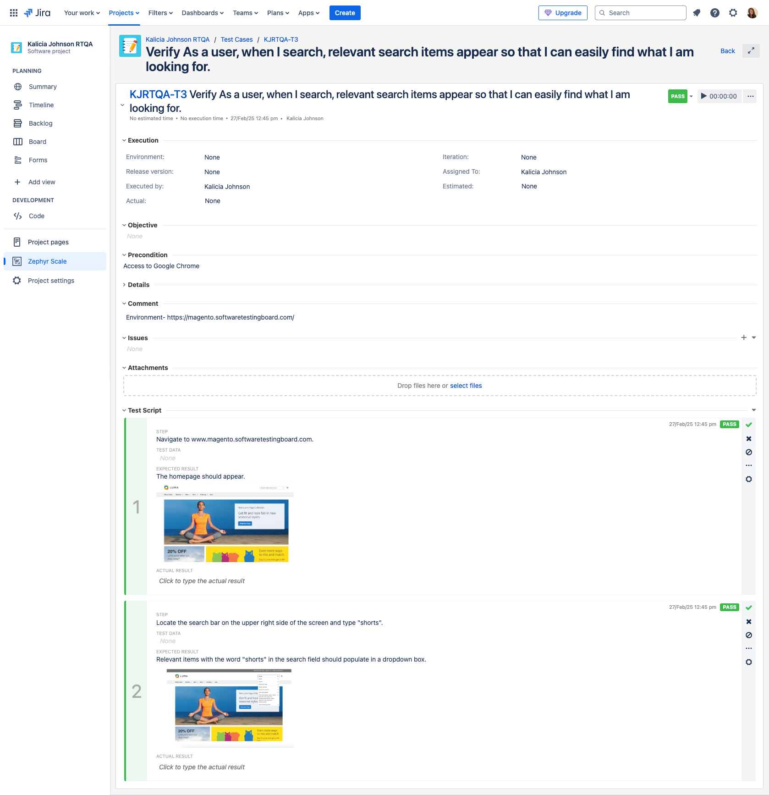
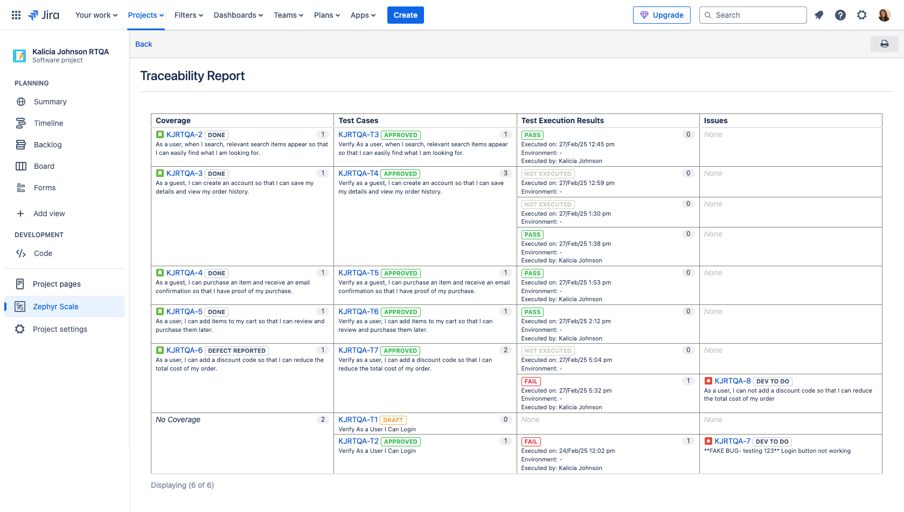
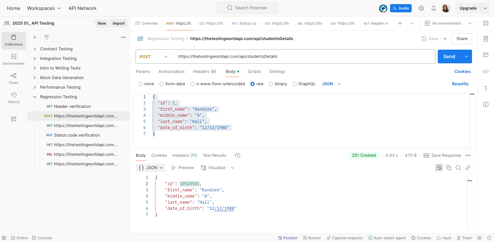
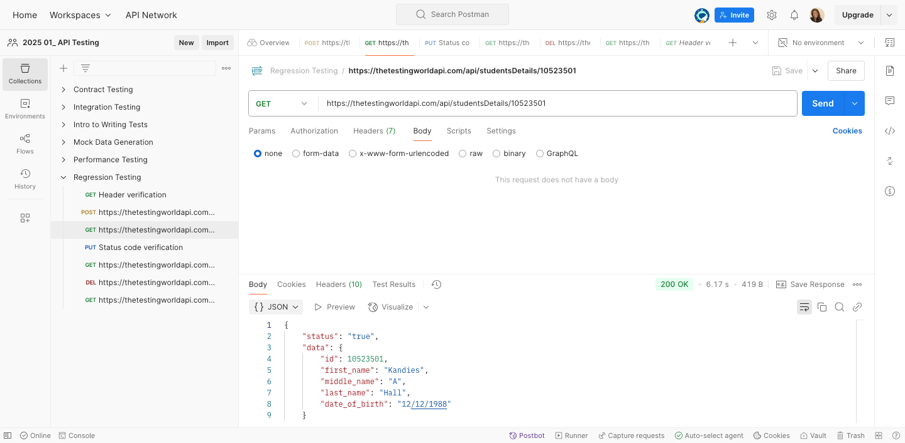
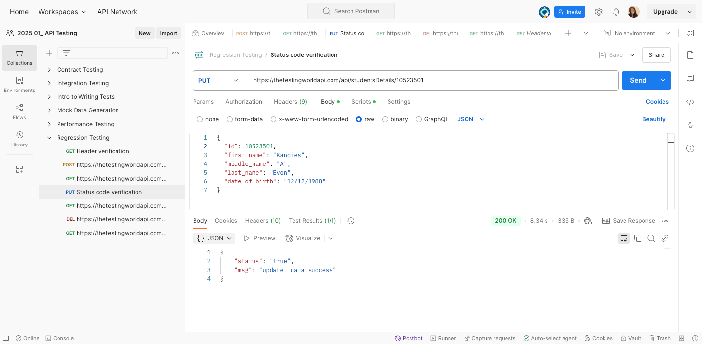

# Portfolio
## ABOUT ME

Hello! I'm Kalicia Johnson 🤓, passionate about Quality Assurance in software development. I wanted to show my love with a small portfolio of skills I gained. 

## MY PROJECTS 

*Snippets (not the entire project) of some of the projects I've been working on.*

**1. Test Case with Jira. Test Execution, Defect Report, & Traceability Report Zephyr Scale.**

   

I participated in a project to test an e-commerce site. I tested the functionality and features.

I gathered business requirements from the project manager, which included user stories, acceptance criteria, functionalities, and expectations for the e-commerce site.

**2. End-to-end manual testing in Postman using REST API.**

   

1. Use the Student Management System
2. Add a POST Request: Add Student, Kandies A Hall, to the system.
3. Make GET Request: To retrieve data of students I added in the  prior step.
4. Make a PUT Request: Update Kandies A Hall to Kandies A Evon in the system.
5. Again Make a GET Request: To validate whether PUT worked correctly or did not work correctly.
6. Make a DELETE Request: To Delete the student’s data.
7. Again make one last GET Request: To validate whether DELETE worked correctly or did not work correctly. 
